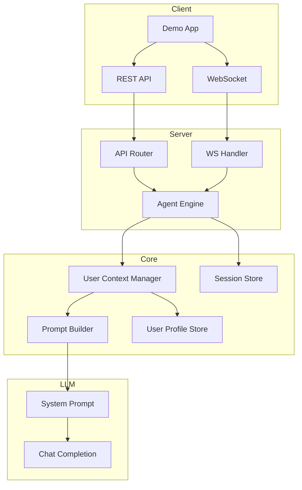

# Design Document: User Context

## Overview

本设计为 DataAgent 添加用户上下文感知能力，使 AI 助手能够：
1. 识别当前用户身份并回答"我是谁"类问题
2. 在对话中自动将"我"等代词解析为用户真实身份
3. 在工具调用时提供用户上下文

核心思路是通过 System Prompt 注入用户信息，让 LLM 理解当前对话的用户身份。

## Architecture



## Components and Interfaces

### 1. UserProfile 数据模型

```python
@dataclass
class UserProfile:
    """用户档案信息"""
    user_id: str                          # 用户唯一标识
    username: str                         # 登录用户名
    display_name: str                     # 显示名称（中文名）
    email: str | None = None              # 邮箱
    department: str | None = None         # 部门
    role: str | None = None               # 角色
    custom_fields: dict[str, Any] = None  # 自定义字段
    created_at: datetime | None = None
    updated_at: datetime | None = None
```

### 2. UserProfileStore 接口

```python
class UserProfileStore(ABC):
    """用户档案存储接口"""
    
    @abstractmethod
    async def get_profile(self, user_id: str) -> UserProfile | None:
        """获取用户档案"""
        pass
    
    @abstractmethod
    async def save_profile(self, profile: UserProfile) -> None:
        """保存用户档案"""
        pass
    
    @abstractmethod
    async def delete_profile(self, user_id: str) -> bool:
        """删除用户档案"""
        pass
    
    @abstractmethod
    async def update_profile(self, user_id: str, updates: dict) -> UserProfile | None:
        """更新用户档案"""
        pass
```

### 3. UserContextManager

```python
class UserContextManager:
    """用户上下文管理器"""
    
    def __init__(self, profile_store: UserProfileStore):
        self._store = profile_store
    
    async def get_user_context(self, user_id: str) -> dict[str, Any]:
        """获取用户上下文，用于注入到 System Prompt"""
        profile = await self._store.get_profile(user_id)
        if not profile:
            return {"user_id": user_id, "is_anonymous": True}
        return self._build_context(profile)
    
    def build_system_prompt_section(self, context: dict) -> str:
        """构建 System Prompt 中的用户信息部分"""
        pass
```

### 4. PromptBuilder 增强

```python
class PromptBuilder:
    """提示词构建器"""
    
    def build_system_prompt(
        self,
        base_prompt: str,
        user_context: dict | None = None,
        tools: list | None = None,
    ) -> str:
        """构建完整的 System Prompt"""
        sections = [base_prompt]
        
        if user_context:
            sections.append(self._build_user_section(user_context))
        
        if tools:
            sections.append(self._build_tools_section(tools))
        
        return "\n\n".join(sections)
    
    def _build_user_section(self, context: dict) -> str:
        """构建用户信息部分"""
        return f"""## 当前用户信息
你正在与以下用户对话：
- 用户ID: {context.get('user_id')}
- 姓名: {context.get('display_name', '未知')}
- 用户名: {context.get('username', '未知')}
- 部门: {context.get('department', '未知')}

重要提示：
- 当用户说"我"、"我的"、"本人"时，指的是上述用户
- 在查询数据时，请使用用户的真实姓名或用户名
- 回答用户身份相关问题时，使用上述信息"""
```

### 5. API 请求模型更新

```python
class ChatRequest(BaseModel):
    """聊天请求"""
    session_id: str
    message: str
    user_context: UserContextRequest | None = None  # 新增

class UserContextRequest(BaseModel):
    """用户上下文请求"""
    user_id: str
    username: str | None = None
    display_name: str | None = None
    email: str | None = None
    department: str | None = None
    role: str | None = None
    custom_fields: dict[str, Any] | None = None
```

### 6. WebSocket 消息更新

```python
# 连接时发送用户上下文
{
    "type": "set_user_context",
    "payload": {
        "user_id": "zhangsan",
        "display_name": "张三",
        "department": "数据部"
    }
}

# 聊天消息包含用户上下文
{
    "type": "chat",
    "payload": {
        "message": "帮我查询我今年的绩效",
        "user_id": "zhangsan"
    }
}
```

## Data Models

### SQLite 表结构

```sql
CREATE TABLE IF NOT EXISTS user_profiles (
    user_id TEXT PRIMARY KEY,
    username TEXT NOT NULL,
    display_name TEXT NOT NULL,
    email TEXT,
    department TEXT,
    role TEXT,
    custom_fields TEXT,  -- JSON
    created_at TIMESTAMP DEFAULT CURRENT_TIMESTAMP,
    updated_at TIMESTAMP DEFAULT CURRENT_TIMESTAMP
);

CREATE INDEX idx_user_profiles_username ON user_profiles(username);
```

### Session 扩展

```python
@dataclass
class Session:
    session_id: str
    user_id: str
    user_context: dict | None = None  # 新增：缓存的用户上下文
    created_at: datetime
    updated_at: datetime
```

## Correctness Properties

*A property is a characteristic or behavior that should hold true across all valid executions of a system-essentially, a formal statement about what the system should do. Properties serve as the bridge between human-readable specifications and machine-verifiable correctness guarantees.*

### Property 1: System Prompt 包含用户信息
*For any* user with a valid profile, when a message is sent, the system prompt SHALL contain the user's display_name and user_id.
**Validates: Requirements 1.1, 1.4**

### Property 2: 用户档案字段完整性
*For any* UserProfile with standard fields set, serializing then deserializing SHALL produce an equivalent profile with all fields preserved.
**Validates: Requirements 3.1, 3.3, 3.4**

### Property 3: 自定义字段支持
*For any* UserProfile with custom_fields, the custom fields SHALL be preserved through storage and retrieval.
**Validates: Requirements 3.2**

### Property 4: API 接受用户上下文
*For any* chat request with user_context, the system SHALL pass the context to the agent engine.
**Validates: Requirements 4.1, 4.2**

### Property 5: WebSocket 会话上下文保持
*For any* WebSocket session with user context set, all subsequent messages in that session SHALL have access to the same user context.
**Validates: Requirements 4.3, 5.2**

### Property 6: 会话关联用户上下文
*For any* session created with a user_id, the session SHALL store and return the associated user context.
**Validates: Requirements 5.1, 5.4**

### Property 7: 用户数据隔离
*For any* user requesting profile data, the system SHALL only return profiles where user_id matches the requester.
**Validates: Requirements 6.4**

### Property 8: Prompt 不包含敏感信息
*For any* system prompt generated with user context, the prompt SHALL NOT contain the user's email address.
**Validates: Requirements 6.3**

## Error Handling

1. **用户档案不存在**: 返回匿名用户上下文，System Prompt 中标注用户信息未配置
2. **用户上下文格式错误**: 返回 400 错误，提示字段验证失败
3. **存储失败**: 返回 500 错误，记录日志但不影响对话功能
4. **会话不存在**: 创建新会话并关联用户上下文

## Testing Strategy

### 单元测试
- UserProfile 数据模型的序列化/反序列化
- UserProfileStore 的 CRUD 操作
- PromptBuilder 的用户信息部分构建
- UserContextManager 的上下文获取和格式化

### 属性测试
使用 `hypothesis` 库进行属性测试：
- Property 1-8 的验证
- 随机用户档案的存储和检索
- 随机自定义字段的处理

### 集成测试
- API 端点接受用户上下文
- WebSocket 会话上下文保持
- 完整对话流程中的用户上下文传递

### 端到端测试
- Demo 应用中设置用户信息
- 发送"我是谁"验证响应
- 发送包含"我"的查询验证代词解析
