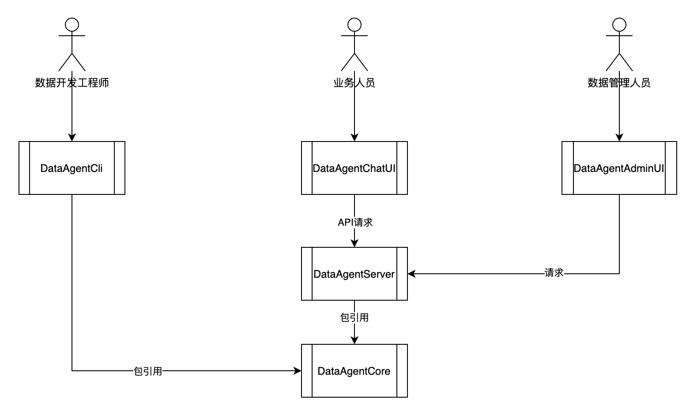
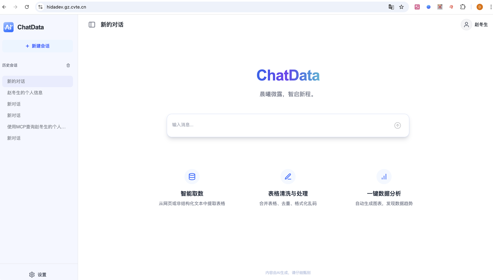

# DataAgent - 企业级数据智能助手平台

## 产品愿景

DataAgent 是基于大语言模型构建的**企业级数据智能助手平台**，旨在让每一位员工都能轻松获取和分析数据，提升企业数据驱动决策的效率。

## 核心价值

| 价值 | 说明 |
|------|------|
| 🚀 **降低数据使用门槛** | 业务人员无需编写 SQL，通过自然语言即可查询数据 |
| ⏱️ **提升工作效率** | 自动化数据分析、报告生成，节省 80% 重复工作时间 |
| 🔒 **安全可控** | 敏感操作需人工审批，确保数据安全合规 |
| 🎯 **专业定制** | 支持企业知识库和技能插件，贴合业务场景 |

## 目标用户

DataAgent 服务三类用户，满足不同场景需求：

### 👨‍💼 普通业务人员
- **使用方式**：Web 聊天界面
- **典型场景**：
  - "帮我查询上个月华东区的销售数据"
  - "生成一份 Q3 用户增长分析报告"
  - "这个数据表有哪些字段？"
- **无需技术背景**，像聊天一样获取数据洞察

### 👨‍💻 数据开发工程师
- **使用方式**：命令行终端 (CLI)
- **典型场景**：
  - 编写和调试 ETL 脚本
  - 数据质量检查和修复
  - 快速原型开发
- **类似 Claude Code 的体验**，AI 辅助编码

### 👨‍🔧 数据管理人员
- **使用方式**：Web 管理界面
- **典型场景**：
  - 维护数据资产目录
  - 开发业务技能插件
  - 管理用户权限
- **为业务人员提供更好的数据服务**

## 产品架构



```
┌─────────────────────────────────────────────────────────────────────┐
│                        DataAgent 平台                                │
├─────────────────────────────────────────────────────────────────────┤
│                                                                     │
│   ┌─────────────┐    ┌─────────────┐    ┌─────────────┐           │
│   │  Web 界面   │    │  命令行终端  │    │  管理后台   │           │
│   │  (ChatUI)   │    │   (CLI)     │    │  (Admin)    │           │
│   └──────┬──────┘    └──────┬──────┘    └──────┬──────┘           │
│          │                  │                  │                   │
│          └──────────────────┼──────────────────┘                   │
│                             │                                       │
│                             ▼                                       │
│   ┌─────────────────────────────────────────────────────────────┐ │
│   │                    DataAgent Server                          │ │
│   │                                                              │ │
│   │  • REST API 接口      • 实时 WebSocket 通信                  │ │
│   │  • 用户认证授权        • 会话管理                            │ │
│   │  • 操作审批流程        • 消息历史记录                        │ │
│   └─────────────────────────────────────────────────────────────┘ │
│                             │                                       │
│                             ▼                                       │
│   ┌─────────────────────────────────────────────────────────────┐ │
│   │                    DataAgent Core                            │ │
│   │                                                              │ │
│   │  • AI 对话引擎         • 工具调用系统                        │ │
│   │  • 企业知识库          • 技能插件系统                        │ │
│   │  • 长期记忆            • 安全审批机制                        │ │
│   └─────────────────────────────────────────────────────────────┘ │
│                             │                                       │
│                             ▼                                       │
│   ┌─────────────────────────────────────────────────────────────┐ │
│   │                    外部系统集成                               │ │
│   │                                                              │ │
│   │  • 大语言模型 (OpenAI/Claude/Gemini)                        │ │
│   │  • 数据库系统 (MySQL/Hive/ClickHouse)                       │ │
│   │  • 企业应用 (数据目录/报表系统/BI工具)                       │ │
│   └─────────────────────────────────────────────────────────────┘ │
└─────────────────────────────────────────────────────────────────────┘
```

## 核心功能

### 1. 智能对话

用户通过自然语言与 AI 助手交互，AI 理解意图后自动执行相应操作：

- **数据查询**：将自然语言转换为 SQL 查询
- **数据分析**：自动进行统计分析和可视化
- **报告生成**：根据数据生成分析报告
- **知识问答**：基于企业知识库回答问题

### 2. 安全审批 (Human-in-the-Loop)

敏感操作需要用户确认，确保安全可控：

- 执行 SQL 前需用户确认
- 文件写入前需用户审批
- 外部系统调用需授权
- 支持自动审批模式（开发场景）

### 3. 技能插件系统

支持扩展 AI 助手的能力：

- **内置技能**：SQL 执行、文件操作、Web 搜索
- **自定义技能**：企业可开发专属技能插件
- **知识库**：导入企业文档和数据字典

### 4. 会话管理

完整的对话历史和上下文管理：

- 多轮对话支持
- 历史记录查询
- 会话状态持久化
- 支持 MySQL 存储

## 产品界面

### Web 聊天界面




### 命令行终端

```
┌─────────────────────────────────────────────────────────────────┐
│  DataAgent CLI                                                   │
├─────────────────────────────────────────────────────────────────┤
│                                                                  │
│  You: 帮我查询用户表的结构                                        │
│                                                                  │
│  🤖 Agent: 我来查询用户表的结构...                                │
│                                                                  │
│  ⚡ Tool Call: sql_execute                                       │
│     DESCRIBE users;                                              │
│                                                                  │
│  ⚠️  需要您的确认 [Y/n/a]:                                       │
│                                                                  │
│  ✅ 执行成功                                                     │
│                                                                  │
│  用户表包含以下字段：                                             │
│  - id: 用户ID (INT)                                              │
│  - name: 用户名 (VARCHAR)                                        │
│  - email: 邮箱 (VARCHAR)                                         │
│  - created_at: 创建时间 (DATETIME)                               │
│                                                                  │
└─────────────────────────────────────────────────────────────────┘
```

## 技术实现

### 已完成功能

| 模块 | 功能 | 状态 |
|------|------|------|
| DataAgent Core | AI 引擎、事件系统、中间件、工具系统 | ✅ 已完成 |
| DataAgent Server | REST API、WebSocket、认证、会话管理 | ✅ 已完成 |
| DataAgent CLI | 终端交互、渲染、HITL 审批 | ✅ 已完成 |
| MySQL 存储 | 会话持久化、消息历史 | ✅ 已完成 |
| Demo 应用 | Streamlit 演示界面 | ✅ 已完成 |

### 技术栈

- **后端**：Python 3.11+、FastAPI、WebSocket
- **AI 引擎**：LangChain、LangGraph、DeepAgents
- **数据库**：MySQL (可选)、内存存储
- **前端**：React (ChatUI)、Streamlit (Demo)

## 部署方式

### 快速体验

```bash
# 1. 配置 API Key
export OPENAI_API_KEY=sk-xxx

# 2. 启动服务
dataagent-server

# 3. 访问 Demo
http://localhost:8000
```

### 生产部署

- 支持 Docker 容器化部署
- 支持 Kubernetes 集群部署
- 支持多实例负载均衡
- 支持 MySQL 持久化存储

## 企业级特性（规划中）

### 🔌 MCP 工具扩展

**MCP (Model Context Protocol)** 是一种标准化的 AI 工具扩展协议，让 DataAgent 能够连接更多外部系统：

```
┌─────────────────────────────────────────────────────────────────┐
│                    MCP 工具扩展架构                              │
├─────────────────────────────────────────────────────────────────┤
│                                                                  │
│   DataAgent                                                      │
│       │                                                          │
│       ├──▶ MCP Server: 数据库查询                                │
│       │    └─ 连接 MySQL、PostgreSQL、ClickHouse                 │
│       │                                                          │
│       ├──▶ MCP Server: 文件系统                                  │
│       │    └─ 安全的文件读写操作                                  │
│       │                                                          │
│       ├──▶ MCP Server: 企业应用                                  │
│       │    └─ 连接 Jira、Confluence、飞书                        │
│       │                                                          │
│       └──▶ MCP Server: 自定义工具                                │
│            └─ 企业自研的业务系统                                  │
│                                                                  │
└─────────────────────────────────────────────────────────────────┘
```

**配置方式**：

- **CLI 模式**：通过配置文件 `~/.deepagents/{assistant}/mcp.json` 静态配置
- **Server 模式**：通过 REST API 为每个用户动态配置不同的工具集

**价值**：
- 🔧 **灵活扩展**：无需修改代码即可添加新工具
- 🏢 **企业定制**：不同部门可配置不同的工具集
- 🔒 **安全隔离**：每个用户的工具配置相互独立

### 👥 多租户与用户隔离

支持企业级多租户部署，确保数据安全和资源隔离：

```
┌─────────────────────────────────────────────────────────────────┐
│                      多租户隔离架构                              │
├─────────────────────────────────────────────────────────────────┤
│                                                                  │
│   租户 A (企业客户)              租户 B (企业客户)               │
│   ┌─────────────────┐           ┌─────────────────┐             │
│   │ 用户 A1  用户 A2│           │ 用户 B1  用户 B2│             │
│   │    │       │    │           │    │       │    │             │
│   │    ▼       ▼    │           │    ▼       ▼    │             │
│   │ ┌───────────┐   │           │ ┌───────────┐   │             │
│   │ │ 独立会话  │   │           │ │ 独立会话  │   │             │
│   │ │ 独立记忆  │   │           │ │ 独立记忆  │   │             │
│   │ │ 独立文件  │   │           │ │ 独立文件  │   │             │
│   │ │ 独立工具  │   │           │ │ 独立工具  │   │             │
│   │ └───────────┘   │           │ └───────────┘   │             │
│   └─────────────────┘           └─────────────────┘             │
│                                                                  │
└─────────────────────────────────────────────────────────────────┘
```

**隔离维度**：

| 维度 | 说明 |
|------|------|
| 🗂️ **会话隔离** | 每个用户只能看到自己的对话历史 |
| 🧠 **记忆隔离** | AI 只记住当前用户的上下文，不会混淆 |
| 📁 **文件隔离** | 每个用户有独立的工作区，无法访问他人文件 |
| 🔧 **工具隔离** | 每个用户可配置不同的 MCP 工具集 |
| 📊 **配额管理** | 支持按租户/用户设置资源配额 |

**价值**：
- 🔒 **数据安全**：用户数据完全隔离，符合企业合规要求
- 💼 **SaaS 部署**：支持多企业共享同一套系统
- 📈 **资源管控**：防止单用户占用过多资源

## 未来规划

| 阶段 | 功能 | 状态 |
|------|------|------|
| Phase 1 | 核心功能（AI 引擎、Server、CLI） | ✅ 已完成 |
| Phase 2 | 数据持久化（MySQL 存储） | ✅ 已完成 |
| Phase 3 | MCP 工具扩展 | 🚧 设计中 |
| Phase 4 | 多租户与用户隔离 | 🚧 设计中 |
| Phase 5 | 企业知识库深度集成 | 📋 规划中 |
| Phase 6 | 可视化报表自动生成 | 📋 规划中 |

## 相关文档

- [快速开始](./getting-started.md) - 安装和运行指南
- [架构概览](./architecture.md) - 技术架构说明
- [API 参考](./api-reference.md) - 接口文档
- [开发人员手册](./developer-guide.md) - 开发指南
